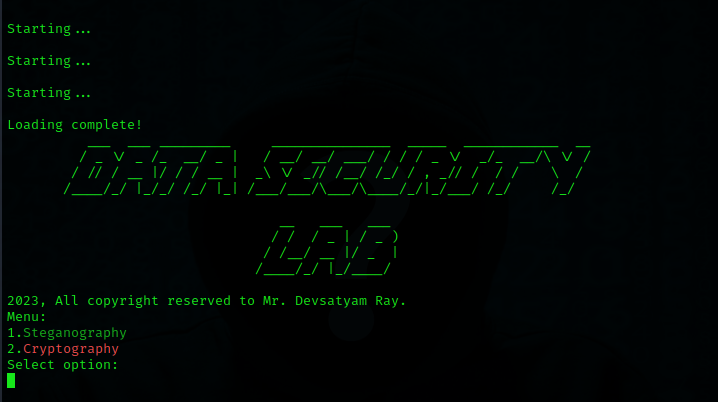

©2023, All rights reserved to Devsatyam Ray. 
IT IS FREE TO USE BUT TAKE PERMISSION BEFORE CHANGING THE SOURCE CODE.

# Data-Security-Lab
This is an interactive platform to secure data very easily. 

# Status
 In Development phase 
 Compatible on any Linux Distro
# Installation
Clone the Repository 
 <code>git clone https://github.com/devsatyamr/Data-Security-Lab</code> 
cd to the project Directory 
 <code>cd Data-Security-Lab</code> 
Manually install packages on your Linux Distro 
 <code>xargs -a cat.txt sudo apt install -y</code> 
Pip Install Python Requirements 
 <code>pip install -r req.txt</code> 
Run the .sh file 
<code>./lab.sh</code> OR <code>bash lab.sh </code> 

That's it! You are good to go!
